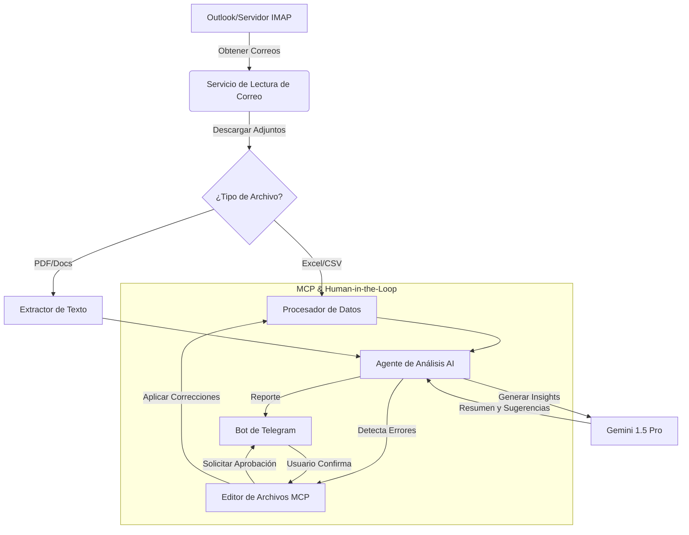

# 📧 Sistema Automatizado de Procesamiento de Correos Inteligente


## 📋 Descripción General

Este proyecto es un **sistema de agente autónomo** diseñado para optimizar los flujos de trabajo de correo corporativo. Monitorea una bandeja de entrada en busca de activadores específicos, procesa adjuntos complejos (Excel, CSV, PDF, Docs), analiza el contenido utilizando **Google Gemini AI**, y entrega resúmenes ejecutivos procesables directamente a un canal de **Telegram**.

Va más allá de la automatización simple al implementar una arquitectura **Human-in-the-Loop (HITL)** a través del Protocolo de Contexto de Modelo (MCP). La IA puede identificar errores en archivos de Excel, proponer correcciones y esperar la aprobación del usuario a través de Telegram antes de aplicar los arreglos y guardar la versión corregida.

## 🏗️ Arquitectura



## ✨ Características Principales

-   **Integración Universal de Correo**: Soporta tanto Microsoft Graph API (Outlook) como protocolos IMAP estándar.
-   **Análisis Inteligente**: Maneja y resume automáticamente archivos Excel, CSV, PDF, Word y de texto.
-   **Insights Potenciados por IA**: Utiliza Gemini para entender el contexto, resumir datos financieros/operativos y resaltar anomalías.
-   **Flujo de Trabajo de Corrección Interactivo**:
    -   La IA detecta inconsistencias de datos en archivos de Excel.
    -   Propone ediciones específicas.
    -   Envía un botón de Telegram al usuario: "¿Aprobar Corrección?".
    -   Ejecuta los cambios tras la confirmación.
-   **Notificaciones en Tiempo Real**: Entrega instantánea de reportes y alertas a dispositivos móviles.

## 🚀 Comenzando

### Prerrequisitos

-   Python 3.9+
-   Registro de App en Microsoft Azure (para Graph API) O credenciales IMAP
-   Google Cloud API Key (Gemini)
-   Token de Bot de Telegram y Chat ID

### Instalación

1.  **Clonar el repositorio**
    ```bash
    git clone https://github.com/tuusuario/sistema-procesamiento-correos.git
    cd sistema-procesamiento-correos
    ```

2.  **Instalar dependencias**
    ```bash
    pip install -r requirements.txt
    ```

3.  **Configuración**
    Crea un archivo `.env` en el directorio raíz:

    ```ini
    # --- Proveedor de Correo (OUTLOOK o IMAP) ---
    EMAIL_PROVIDER=IMAP
    
    # --- Microsoft Graph (Si usas OUTLOOK) ---
    AZURE_CLIENT_ID=tu_client_id
    AZURE_TENANT_ID=tu_tenant_id
    AZURE_CLIENT_SECRET=tu_client_secret
    
    # --- Configuración IMAP (Si usas IMAP) ---
    IMAP_SERVER=imap.gmail.com
    IMAP_PORT=993
    IMAP_USERNAME=tu_email@gmail.com
    IMAP_PASSWORD=tu_app_password
    
    # --- IA y Notificaciones ---
    GEMINI_API_KEY=tu_gemini_key
    TELEGRAM_BOT_TOKEN=tu_bot_token
    TELEGRAM_CHAT_ID=tu_chat_id
    
    # --- Configuración del Sistema ---
    ATTACHMENT_SAVE_PATH=downloads
    ```

### Uso

Ejecuta la aplicación principal:

```bash
python run.py
```

El sistema comenzará a monitorear la bandeja de entrada configurada. Envía un correo con un adjunto de Excel para probar el flujo.

## 📂 Estructura del Proyecto

-   `app/main.py`: Lógica principal de orquestación.
-   `app/email_reader/`: Módulos para conectar con Outlook/IMAP.
-   `app/processor/`: Lógica para analizar Excel, CSV y documentos de texto.
-   `app/ai/`: Cliente para interactuar con Google Gemini.
-   `app/telegram/`: Lógica del bot para enviar mensajes y manejar callbacks.
-   `app/mcp/`: Servidor del Protocolo de Contexto de Modelo para operaciones de edición de archivos.

## 🛡️ Seguridad

-   **Gestión de Tokens**: Utiliza caché seguro de tokens para credenciales de Azure.
-   **Variables de Entorno**: Todas las claves sensibles se cargan desde `.env` (excluido de git).
-   **Procesamiento Local**: Los archivos se procesan localmente antes de enviar los resúmenes.

---
*Construido como una demostración de flujos de trabajo modernos de IA Agéntica.*
